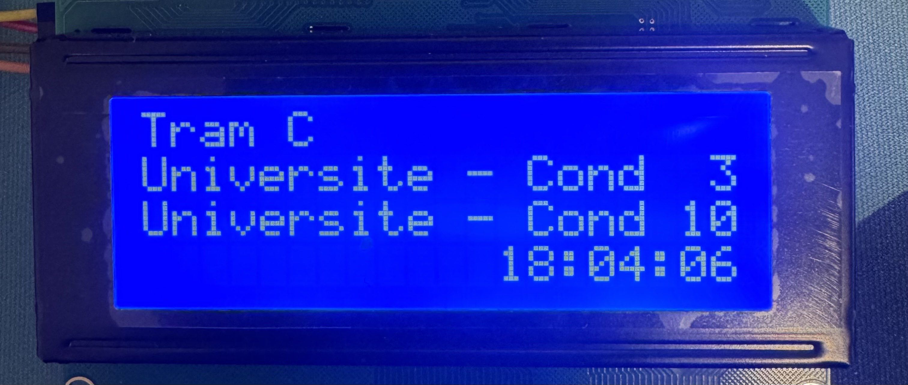

# Next Tramway ESP32

A real-time tramway arrival display system built with Rust for the ESP32-C6 microcontroller. This project connects to an MQTT server to receive tramway schedule updates and displays them on a 20x4 LCD screen via I2C.

This system is specifically designed for use in Grenoble, France, leveraging the M-Mobilités API to fetch real-time tramway data.



## Features

- **Real-time MQTT Updates**: Subscribes to `next-tramway/line/#` topics to receive live tramway arrival information
- **LCD Display**: Shows next passages with destinations and arrival times on a 20x4 character LCD
- **WiFi Connectivity**: Automatic connection and reconnection to WiFi networks
- **Multi-line Support**: Handles multiple tramway lines and directions
- **Interactive UI**: Button-based navigation to cycle through different screens
- **Async Architecture**: Built with Embassy for efficient async/await operations

## Hardware Requirements

- **Microcontroller**: ESP32-C6 (RISC-V)
- **Display**: 20x4 LCD with I2C interface (PCF8574 I2C expander)
- **Button**: Push button for screen navigation (GPIO4)
- **Connections**:
  - I2C SDA: GPIO6
  - I2C SCL: GPIO7
  - Button: GPIO4 (with internal pull-up)

## Software Stack

- **Language**: Rust 
- **HAL**: `esp-hal` v1.0.0
- **RTOS**: `esp-rtos` v0.2.0 with Embassy executor
- **Networking**: `embassy-net` with DHCP support
- **MQTT Client**: `rust-mqtt` v0.4.1 (MQTT v5 protocol)
- **Display Driver**: Custom I2C LCD driver implementation

## Project Structure

```
next-tramway-esp32/
├── src/
│   ├── bin/
│   │   └── main.rs       # Main application entry point
│   ├── display.rs        # UI state management and command logic
│   ├── lcd.rs            # LCD driver and rendering implementation
│   └── lib.rs            # Library exports
├── .env                  # Environment variables for WiFi and MQTT configuration
├── .env.sample           # Sample environment variables file
├── flake.nix             # Nix flake for reproducible development environment
├── next_tramway.py       # Home Assistant script for sending MQTT messages
```

## Configuration

### Configuration

This project uses a `.env` file to manage environment variables. Create a `.env` file in the root directory of the project and define the following variables:

```
SSID=your_wifi_ssid
PASSWORD=your_wifi_password
MQTT_HOST=192.168.1.100 # doesn't support DNS for now
MQTT_PORT=1883
MQTT_USERNAME=mqtt_user
MQTT_PASSWORD=mqtt_pass
MQTT_CLIENT_ID=next-tramway-esp32
```

You can use the provided `.env.sample` file as a template:

```bash
cp .env.sample .env
```

Make sure to replace the placeholder values with your actual configuration.

### GPIO Configuration

The GPIO pins used in this project are configured as follows:

- **I2C SCL (Clock)**: GPIO7 - This pin is connected to the SCL pin of the LCD module for clock signaling.
- **I2C SDA (Data)**: GPIO6 - This pin is connected to the SDA pin of the LCD module for data transmission.
- **Button Input**: GPIO4 - This pin is connected to a push button. The button is configured with an internal pull-up resistor, so the input reads low when the button is pressed.

> ⚠️ These GPIO assignments can be modified in the `main` function under the GPIO configuration section if you want to use different pins.

```rust
#[esp_rtos::main]
async fn main(spawner: Spawner) {
    //...

    //-------- GPIOs config --------
    let i2c_scl = peripherals.GPIO7; // GPIO used for I2C SCL, connected to the LCD
    let i2c_sda = peripherals.GPIO6; // GPIO used for I2C SDA, connected to the LCD
    let button_gpio = peripherals.GPIO4; // GPIO used for the button input, connected to a push button with a pull-up resistor (so the input is low when the button is pressed)
    //------------------------------

    // ...
}
```

## MQTT

### MQTT Message Format

The system expects MQTT messages on topics like `next-tramway/line/<line>/<direction_id>` with the following format:

#### Topic Parameters

- **`<line>`**  
  A unique identifier for the tram line (for example: `A`, `B`, `C11`, etc.).  
  This value is used only as an identifier, the actual human-readable display name of the line is included inside the MQTT payload.

- **`<direction_id>`**  
  Represents the physical direction of the tram line.  
  It must be either:

  - `1` → First direction (e.g., platform A / one terminus)
  - `2` → Second direction (e.g., platform B / opposite terminus)

  On a real stop, this typically corresponds to the two sides of the platform (each direction having its own screen).

```
Line Name
Destination1|Minutes1|R or S
Destination2|Minutes2|R or S
HH:MM:SS
```

- `R` means the time is real-time.
- `S` means the time is scheduled.

Example:
```
Tram C
Plaine des sports|3|R
Universite - Condillac|8|R
14:35:10
```

### Python Script for MQTT Integration

The project includes a Python script, `next_tramway.py`, designed to work with Home Assistant via AppDaemon. This script fetches real-time tramway schedules from an external API, processes the data, and publishes it to an MQTT broker in the expected format.

The goal is the do as little computation as possible on the ESP32 side, so the script handles all the data fetching and formatting before sending it to the microcontroller. It's also assumed that the ESP32 can trust the data sent by the script, so minimal validation is performed on the ESP32 side.

#### Compatibility

While the script is tailored for Home Assistant and AppDaemon, it can be modified to work independently with any MQTT broker. As long as the data is published in the correct format, other scripts or systems can replace it.

## Building and Flashing

### Prerequisites

1. Follow the [ESP-IDF Installation Guide](https://docs.espressif.com/projects/esp-idf/en/latest/esp32/get-started/) to set up the ESP-IDF framework.
2. Ensure you have the Rust toolchain installed, as specified in `rust-toolchain.toml`.


## Nix Development Environment

This project includes a Nix flake for setting up a reproducible development environment. With Nix, you can ensure all dependencies, including the Rust toolchain and required tools, are consistently installed.

### Usage

1. Install Nix on your system: [Nix Installation Guide](https://nixos.org/download.html)
2. Enter the development shell:
    ```bash
    nix develop
    ```
This will provide all necessary tools and dependencies for building and flashing the project.

## Troubleshooting

### I2C Device Not Found
- Verify GPIO pin connections (SDA: 6, SCL: 7)
- Run the I2C scan on startup to detect device addresses
- Verify LCD backpack address 

## Future Enhancements

- [ ] Support for multiple display types (OLED, e-paper)
- [ ] OTA (Over-The-Air) firmware updates
- [ ] Better logging system
- [ ] Better error message on the display
